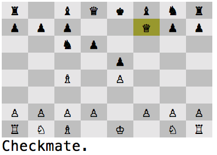

# Chess

Ruby Chess implemented for the UNIX terminal.  
Use WASD or arrow keys to move. Use space or enter to choose a move.

## Plans

- [ ] Castling
- [ ] En passant
- [ ] Pawn promotion
- [ ] AI
